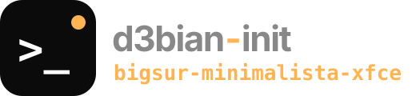
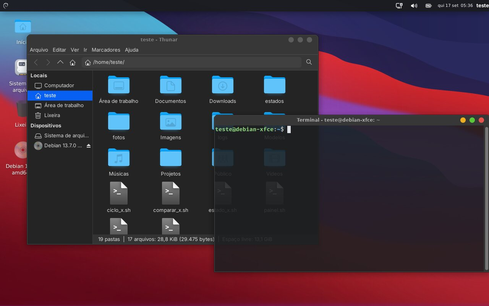
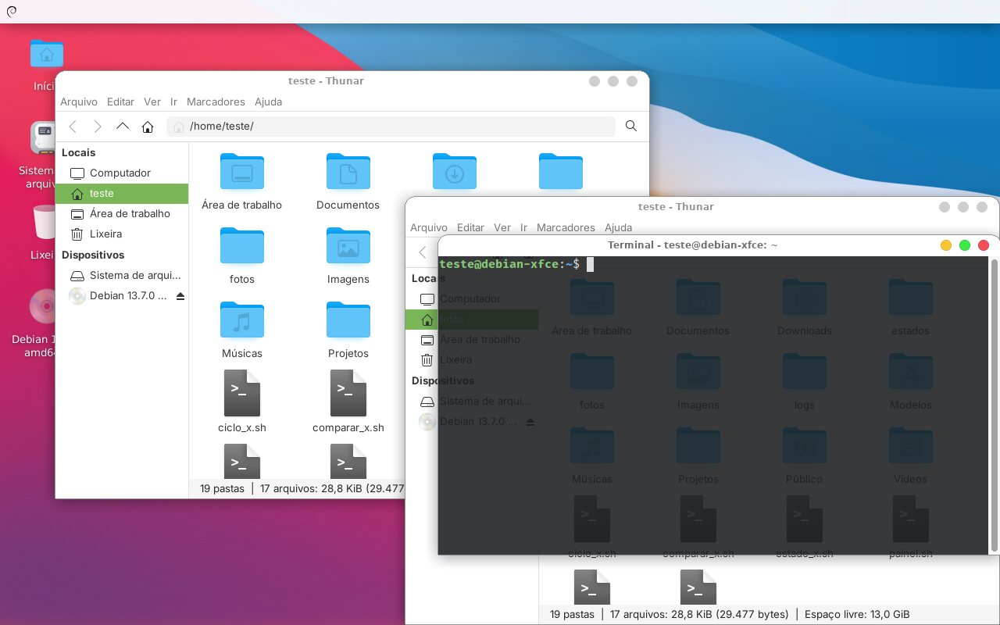
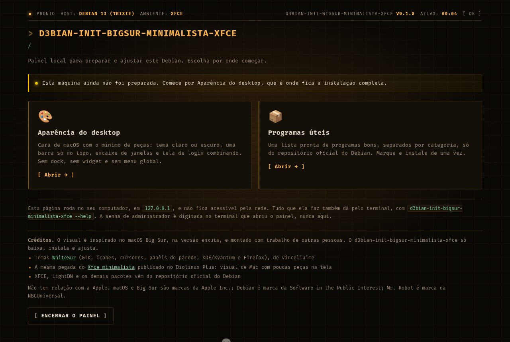
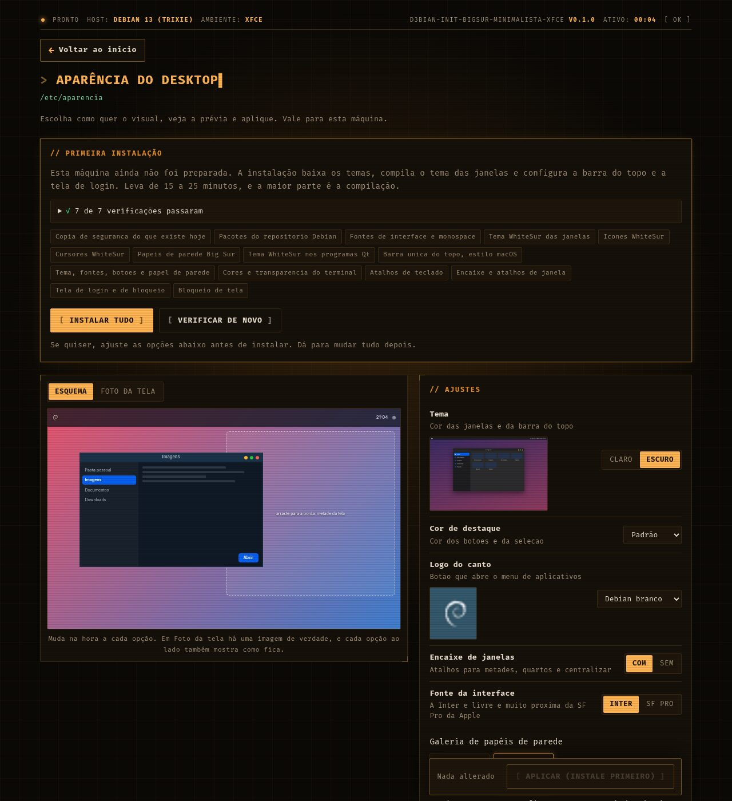
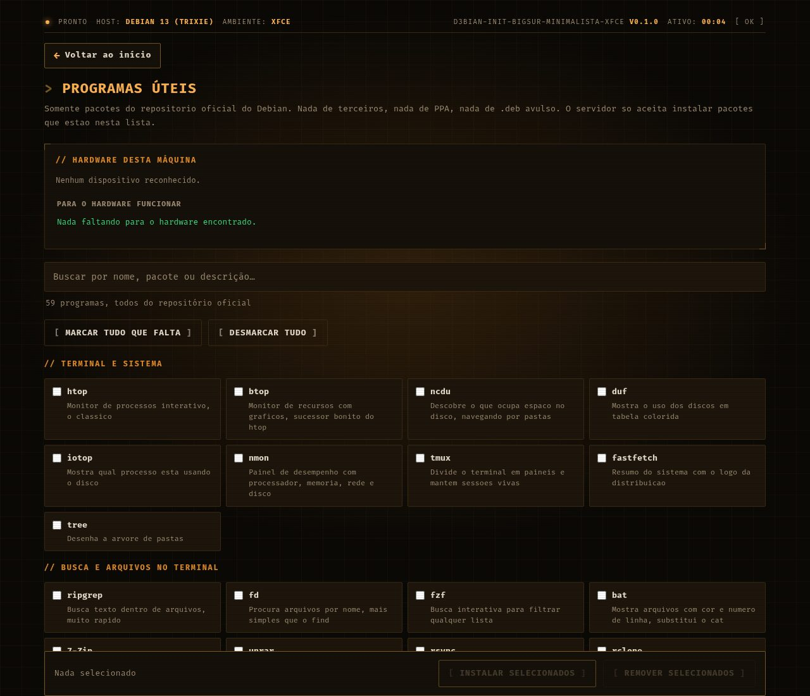
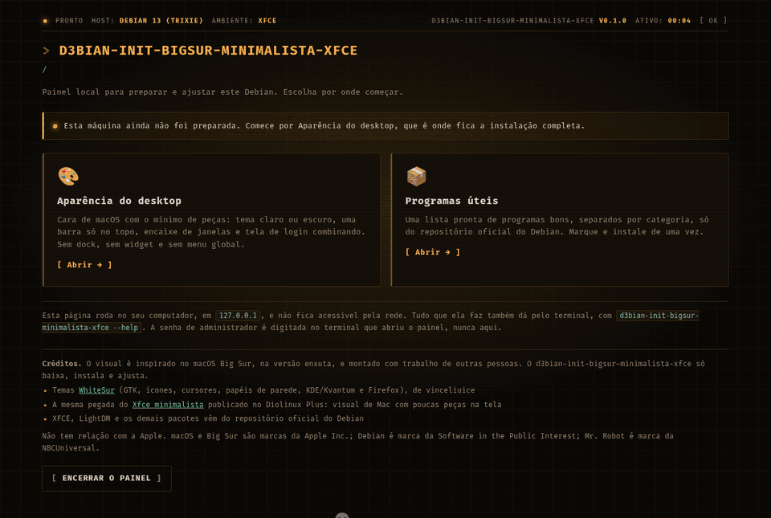

<div align="center">



**Cara de macOS Big Sur no Xfce, sem os enfeites: uma barra só no topo e janelas sólidas.**

[](docs/desenvolvimento.md)
[](docs/desenvolvimento.md)
[](docs/uso.md#sistemas)
[](docs/uso.md#sistemas)
[](LICENSE)

</div>

> A cara de macOS do [bigsur-xfce](https://git.saberdl.dev.br/d3bian/bigsur-xfce),
> **sem os enfeites**: uma barra só no topo, janelas sólidas e nada mais ocupando a
> tela. É a mesma pegada das montagens minimalistas de Xfce com cara de Mac — como
> [esta do Diolinux Plus](https://plus.diolinux.com.br/t/void-xfce-minimalista/74056),
> que usa Orchis Dark MacOS com Papirus Dark —, aqui feita com o WhiteSur. Um painel
> local, aberto no navegador, e só Python da biblioteca padrão — nada de pip.

```sh
git clone https://git.saberdl.dev.br/d3bian/bigsur-minimalista-xfce.git d3bian_init_bigsur_minimalista_xfce
python3 -m d3bian_init_bigsur_minimalista_xfce        # pede a senha uma vez e abre o painel
```

<div align="center">
  
</div>

---

## O que ele faz

- **Tema WhiteSur sólido** nas janelas, claro ou escuro, com a cor de destaque à escolha
- **Ícones e cursores WhiteSur**, e o tema também nos programas Qt (Kvantum)
- **Barra única no topo**, com menu, bandeja, som, bateria, relógio e sair; o logo do canto à escolha
- **Encaixe de janelas** por atalho, bordas mais largas e layouts no Super+Z
- **Papéis de parede** do WhiteSur numa galeria, ou o seu
- **Tela de login e de bloqueio** combinando, com fundo desfocado
- **Programas úteis**: uma lista pronta do repositório oficial do Debian, conforme o hardware
- **Voltar ao que era antes** com um clique, inclusive removendo o que foi instalado

Sem dock, sem compositor extra e sem Conky: quatro pacotes a menos que o
[bigsur completo](https://git.saberdl.dev.br/d3bian/bigsur-xfce) e nenhum processo
permanente além do painel.

<!-- imagens: gerado a partir do teste num Debian 13; refazer, nao editar a mao -->
## Telas

| Com outras opções da página |
|---|
|  |

| Início | Opções | Programas úteis |
|---|---|---|
|  |  |  |

<details>
<summary><b>A instalação pela página, do começo ao resultado</b></summary>



</details>
<!-- fim imagens -->

## Documentação

| | |
|---|---|
| 🚀 [Usando](docs/uso.md) | rodar, o que muda em relação ao completo, opções, o que fica onde, sistemas, voltar ao que era antes |
| 🛠️ [Desenvolvimento](docs/desenvolvimento.md) | receitas, como as imagens de exemplo são geradas |

## Família d3bian-init

Todos com o mesmo motor e o mesmo jeito de usar: um painel local, só Python da biblioteca padrão, e "voltar ao que era antes".

| | Projeto | O que faz |
|---|---|---|
| 💻 | [terminal](https://git.saberdl.dev.br/d3bian/terminal) · [terminal-kde](https://git.saberdl.dev.br/d3bian/terminal-kde) | Fish, Oh My Posh, Nerd Font e cores (xfce4-terminal/GNOME Terminal ou Konsole) |
| 💻 | [zsh](https://git.saberdl.dev.br/d3bian/zsh) · [zsh-kde](https://git.saberdl.dev.br/d3bian/zsh-kde) | Zsh com sugestões e realce, Oh My Posh, Nerd Font e cores |
| 💻 | [bash](https://git.saberdl.dev.br/d3bian/bash) · [bash-kde](https://git.saberdl.dev.br/d3bian/bash-kde) | O bash de sempre, com sugestões e realce, Oh My Posh e Nerd Font |
| 🎨 | [bigsur-kde](https://git.saberdl.dev.br/d3bian/bigsur-kde) · [mactahoe-kde](https://git.saberdl.dev.br/d3bian/mactahoe-kde) | Cara de macOS (Big Sur ou Tahoe) no KDE Plasma 6 |
| 🎨 | [fluent-kde](https://git.saberdl.dev.br/d3bian/fluent-kde) · [chromeos-kde](https://git.saberdl.dev.br/d3bian/chromeos-kde) | Cara de Windows 11 ou de ChromeOS no KDE Plasma 6 |
| 🎨 | [catppuccin-kde](https://git.saberdl.dev.br/d3bian/catppuccin-kde) · [graphite-kde](https://git.saberdl.dev.br/d3bian/graphite-kde) · [layan-kde](https://git.saberdl.dev.br/d3bian/layan-kde) · [orchis-kde](https://git.saberdl.dev.br/d3bian/orchis-kde) | Temas Catppuccin, Graphite, Layan e Orchis no KDE Plasma 6 |
| 🪟 | [bigsur-xfce](https://git.saberdl.dev.br/d3bian/bigsur-xfce) · **bigsur-minimalista-xfce** | Cara de macOS Big Sur no Xfce, completo ou minimalista |
| 🪟 | [minimal-xfce](https://git.saberdl.dev.br/d3bian/minimal-xfce) · [paleta-xfce](https://git.saberdl.dev.br/d3bian/paleta-xfce) | Xfce enxuto, ou numa paleta só (Nord, Gruvbox, Everforest) |
| 🍎 | [tahoe-gnome](https://git.saberdl.dev.br/d3bian/tahoe-gnome) | Cara de macOS Tahoe no GNOME 48 |
| 🧩 | [modelo](https://git.saberdl.dev.br/d3bian/modelo) | O modelo de onde todos saem: crie o seu próprio d3bian-init |

## Créditos

- [WhiteSur](https://github.com/vinceliuice/WhiteSur-gtk-theme), de vinceliuice: tema GTK
  (MIT), [ícones](https://github.com/vinceliuice/WhiteSur-icon-theme) (GPL-3.0),
  [cursores](https://github.com/vinceliuice/WhiteSur-cursors) (GPL-3.0),
  [tema KDE/Kvantum](https://github.com/vinceliuice/WhiteSur-kde) (GPL-3.0) e
  [papéis de parede](https://github.com/vinceliuice/WhiteSur-wallpapers) (MIT). São baixados
  na instalação; o repositório traz só as miniaturas dos papéis, em `recursos/web/papeis`.
- A mesma pegada do [Xfce minimalista](https://plus.diolinux.com.br/t/void-xfce-minimalista/74056)
  publicado no Diolinux Plus.
- Fontes [Inter](https://rsms.me/inter/), [Fira Code](https://github.com/tonsky/FiraCode) e
  Noto Color Emoji, do repositório do Debian (SIL OFL). A SF Pro, opcional, é baixada de um
  [espelho público](https://github.com/sahibjotsaggu/San-Francisco-Pro-Fonts) e segue a licença da Apple.
- Xfce, LightDM e os demais pacotes vêm do repositório oficial do Debian.
- Não tem relação com a Apple. macOS e Big Sur são marcas da Apple Inc.; Debian é marca
  da Software in the Public Interest.

---

<div align="center">
<sub>Código sob a <a href="LICENSE">licença MIT</a> · feito para o Debian 13</sub>
</div>
